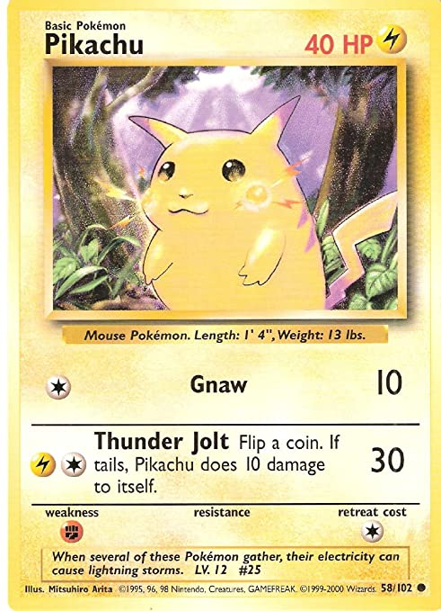

# 💻 PROJECT: WD1 - Trading Card Game

## 🥅 Overzicht en Leerdoelen

Met dit project leer je wat een vlakke database, JSON en AJAX zijn, waar ze voor dienen en leer je ze gebruiken om een database voor de trading card game te maken.

## 🔍 Trading Card Game

Je gaat een database maken van kaarten uit één trading card game. Bekende voorbeelden hiervan zijn Pokémon, Magic the Gathering, Hearthstone, ... Je mag kaarten uit een bestaand spel gebruiken, **of je mag zelf kaarten verzinnen.**

Het project bestaat uit verschillende opdrachten. Je begint met de herhalingsopdracht over HTML en CSS. Je kan ondertussen beginnen met data te verzamelen over de verschillende kaarten die je in je database opslaat. Belangrijk daarbij is dat een kaart uit verschillende eigenschappen bestaat. 

> Voor Pokémon is dit bijvoorbeeld:
>  - **name**: de naam van de kaart\
>    bv.: Pikachu
>  - **hp**: hoeveel levenspunten heeft de kaart\
>    bv.: 40
>  - **flavour text**: een tekst die het personage beschrijft\
>    bv.: When several of these pokémon gather, their electricity can cause lightning storms
>  - **rarity**: het niveau van zeldzaamheid van de kaart.\
>    bv.: *common*, *uncommon* of *rare*
>  - **type**: tot welke groep of soort behoort de kaart?
>    bv.: electricity
>  - **abilities**: een lijst met acties die de kaart kan doen. Elke ability heeft zelf ook verschillende > eigenschappen:
>    - cost
>    - damage
>    - name
>    - explanation
>  - ...

## 🛠️ Opdrachten

opdracht 1: herhaling HTML en CSS

>  - [ ] Maak een pagina genaamd `card.html`, waarop je met HTML en CSS een kaart maakt van één personage. Hou rekening met de onderdelen die kunnen veranderen als je er een ander personage op wilt plaatsen.\
>    Kijk voor inspiratie voor de kaart naar kaarten van bekende TCGs, of (als je een bestaande TCG gebruikt) maak de kaarten na van het spel dat je gebruikt als basis.\
>    bv.: als ik de kaart van Pikachu namaak, kunnen de symbolen, afbeelding, kleuren, teksten... veranderen. De plaats van elke tekst, foto, ... verandert echter niet. Ik moet dus slim omgaan met klassen en IDs, zodat ik deze later gemakkelijk kan aanpassen.\
>    
>  - [ ] [Gebruik het CUBE principe](https://t-informatica.github.io/courses/webontwikkeling/statische-websites/cube.html) om je CSS stijlregels een logische plek te geven.

---

opdracht 2: database ontwerpen

> - [ ] Maak een Markdown bestand aan genaamd `databaseontwerp.md`
> - [ ] Beschrijf de eigenschappen die één kaart heeft. 
>   - Duidt aan welke eigenschappen verplicht zijn, en welke optioneel.
>   - Duidt aan welk datatype geschikt is voor elke eigenschap.
>   - Duidt aan welke eigenschappen gebruikt kunnen worden als unieke ID voor een kaart.

---

opdracht 3: JSON database

> - [ ] Maak een JSON bestand aan genaamd `database.json`
> - [ ] Maak een lijst van objecten. Elk object bevat de eigenschappen die je in `databaseontwerp.md` hebt beschreven.

---

opdracht 4: lijst tonen met AJAX

> - [ ] Maak een nieuwe pagina genaamd `search.html`
> - [ ] Maak een ongenummerde lijst aan in HTML
> - [ ] Vul de ongenummerde lijst in met behulp van AJAX. De lijst toont de namen van elk personage
>   - [ ] Maak een functie die `database.json` laadt wanneer de pagina klaar is met laden
>   - [ ] Maak een callback functie die wordt aangeroepen wanneer `database.json` klaar is met laden
>   - [ ] Zet de tekst van `database.json` om naar een javascript object
>   - [ ] Haal de naam op van elke kaart in het javascript object, en plaats het in de ongenummerde lijst\
>     **hint**: het helpt als je je HTML-lijst een duidelijke ID geeft

---

opdracht 5: lijst filteren met Javascript

> - [ ] Maak een invulveld voor tekst aan op de pagina `search.html`
> - [ ] Wanneer de gebruiker letters typt, worden enkel de kaarten getoond met de naam die begint met die letters\
>   bv.: typt de gebruiker de letters 'Pi', dan worden 'Pikachu' en 'Piplup' wel getoond, maar 'Charmander' en 'Panpour' niet
>   - [ ] Maak een functie aan die `database.json` laadt wanneer de gebruiker iets typt in het invulveld
>   - [ ] Maak een callback functie die wordt aangeroepen wanneer `database.json` klaar is met laden
>   - [ ] Haal de naam op van elke kaart in het javascript object, en plaats het in de ongenummerde lijst als het begin van de naam de letters van het invulveld bevat\
>     **hint**: het helpt als je je invulveld een duidelijke ID geeft

---

opdracht 6: detailpagina tonen

> - [ ] Zorg ervoor dat de naam in de lijst een link wordt naar `card.html` en voorzie een URL parameter met de naam van de kaart.
> - [ ] Maak voor de pagina `card.html` een functie die `database.json` laadt wanneer de pagina klaar is met laden
> - [ ] Maak een callback functie die wordt aangeroepen wanneer `database.json` klaar is met laden
> - [ ] Zet de tekst van `database.json` om naar een javascript object
> - [ ] Zoek naar de juiste kaart, met behulp van de URL parameter. Vul de details van de kaart in op basis van het javascript object.\
>   **hint**: als je in het begin duidelijke classes en IDs hebt gebruikt, is dit veel gemakkelijker.

---

## 💡 Belangrijke Termen

| Term     | Definitie |
| -------- | --------- |
| request  | een vraag aan een server om data aan de client te bezorgen. |
| response | data die de server aan de client bezorgt na een request. |
| XML      | een markup taal waarmee je data kunt opslaan met behulp van zelfgekozen tags; |
| AJAX     | een manier om met behulp van Javascript data op te vragen aan een server. |
| JSON     | een manier om javascript objecten in tekst-formaat op te slaan. Met behulp van Javascript kan je deze tekst terug omzetten naar een Javascript object. |
| database | een gestructureerde verzameling van data die zo is ingedeeld dat het gemakkelijk kan worden bekeken, beheerd en bijgewerkt. |

## 📚 Bronnen

 - [cursus dynamische websites](https://t-informatica.github.io/courses/webontwikkeling/dynamische-websites/)
 - [W3Schools AJAX tutorial](https://www.w3schools.com/js/js_ajax_intro.asp)

---

## 🏆 Evaluatie

Dit project wordt geevalueerd op basis van de leerdoelen hieronder.

### Codeblokken

| A   | B   | C   | D   | E   |
| --- | --- | --- | --- | --- |
Iteraties, selecties en functies maken gebruik van de correcte voorwaarden en parameters. Iterator-variabelen worden gebruikt. Het DRY principe wordt zo goed mogelijk toegepast door te kiezen voor de juiste codeblokken. | Iteraties, selecties en functies maken gebruik van de correcte voorwaarden en parameters. Iterator-variabelen worden gebruikt. Het DRY principe wordt niet altijd toegepast door de codeblokken die je kiest. | Iteraties, selecties en functies maken gebruik van de correcte voorwaarden en parameters. Iterator-variabelen worden niet gebruikt. Het DRY principe wordt niet altijd toegepast door de codeblokken die je kiest. | Iteraties en selecties maken gebruik van de correcte voorwaarden. Iterator-variabelen worden niet gebruikt. Functies en parameters worden niet altijd correct toegepast. Het DRY principe wordt niet altijd toegepast door de codeblokken die je kiest. | Iteraties en selecties maken geen gebruik van de correcte voorwaarden. Iterator-variabelen worden niet gebruikt. Functies en parameters worden niet altijd correct toegepast. Het DRY principe wordt niet altijd toegepast door de codeblokken die je kiest.

### Instructies

| A   | B   | C   | D   | E   |
| --- | --- | --- | --- | --- |
Variabelen worden correct geinitialiseerd en je maakt correct gebruik van de verschillende datatypes en operators. | Enkele variabelen worden nog niet juist geinitialiseerd. Je maakt wel correct gebruik van de verschillende datatypes en operators. | Je gebruik van de verschillende operators is correct. Je gebruikt de verschillende datatypes nog niet correct. Variabelen worden nog niet juist geinitialiseerd. | Je gebruik van de verschillende datatypes is correct. Je gebruikt de verschillende operators nog niet correct. Variabelen worden nog niet juist geinitialiseerd. | Variabelen worden niet goed geinitialiseerd, je maakt verkeerd gebruik van de verschillende datatypes en operators.

### Markup

| A   | B   | C   | D   | E   |
| --- | --- | --- | --- | --- |
Elementen worden correct genest. De semantisch juiste elementen werden gebruikt. De id's en classes van elementen zijn ingevuld waar nodig, maar hebben vaak onduidelijke naamgeving. Elementen zijn onderverdeeld in grotere elementen, en er is gekozen voor een optimale oplossing. | Elementen worden correct genest. De semantisch juiste elementen werden gebruikt. De id's en classes van elementen zijn ingevuld waar nodig, maar hebben vaak onduidelijke naamgeving. Elementen zijn onderverdeeld in grotere elementen, hoewel er oplossingen bestaan die korter of optimaler zijn. | Elementen worden correct genest. De semantisch juiste elementen werden gebruikt. Elementen zijn niet voldoende onderverdeeld in grotere elementen. De id's en classes van elementen zijn ingevuld waar nodig, maar hebben vaak onduidelijke naamgeving. | Elementen worden correct genest. Elementen zijn niet voldoende onderverdeeld in grotere elementen. Er wordt geen rekening gehouden met de semantiek van de elementen. De id's en classes van elementen zijn ingevuld waar nodig, maar hebben vaak onduidelijke naamgeving. | Elementen worden niet correct genest. Elementen zijn niet voldoende onderverdeeld in grotere elementen. Er wordt geen rekening gehouden met de semantiek van de elementen. De id's en classes van elementen zijn niet of onduidelijk ingevuld waar nodig.

### Opmaak
| A   | B   | C   | D   | E   |
| --- | --- | --- | --- | --- |
Selectors zijn correct en voldoende specifiek gedefinieerd. Er werd gekozen voor de correcte stijlregels met de juiste waardes en eenheden. Selectors werden samengevoegd waar nodig. | Selectors zijn correct en voldoende specifiek gedefinieerd. Er werd gekozen voor de correcte stijlregels met de juiste waardes en eenheden. Selectors worden te weinig samengevoegd. | Selectors zijn correct en voldoende specifiek gedefinieerd. Selectors worden te weinig samengevoegd. Er werd gekozen voor de correcte stijlregels, maar de waardes en eenheden werden niet correct gebruikt. | Selectors zijn correct gedefinieerd, maar zijn vaak niet specifiek genoeg. Selectors worden te weinig samengevoegd. Er werd gekozen voor de correcte stijlregels, maar de waardes en eenheden werden niet correct gebruikt. | Selectors zijn verkeerd of niet specifiek genoeg gedefinieerd. Selectors worden te weinig samengevoegd. Stijlregels, waardes en eenheden werden niet correct gebruikt.

### Statische Websites
| A   | B   | C   | D   | E   |
| --- | --- | --- | --- | --- |
Layout, ruimte en interactie zijn correct geïmplementeerd. De website is responsive en Mobile First ontwikkeld. Stijlregels zijn duidelijk en overzichtelijk verzameld in externe stylesheets. Je gebruikt relatieve eenheden (em, rem) en custom properties (variabelen) waar nodig. | Layout, ruimte en interactie zijn correct geïmplementeerd. De website is responsive en Mobile First ontwikkeld. Stijlregels zijn duidelijk en overzichtelijk verzameld in externe stylesheets. Je gebruikt custom properties (variabelen) waar nodig. | De interactie op jouw website is onvoldoende geïmplementeerd. Layout en ruimte zijn correct. De website is responsive en Mobile First ontwikkeld. Stijlregels zijn duidelijk en overzichtelijk verzameld in externe stylesheets. | Ruimte en interactie zijn onvoldoende geïmplementeerd. De website is onvoldoende responsive. Je layout werkt en je hebt de website ontwikkeld volgens het Mobile First principe. | Layout, ruimte en interactie zijn onvoldoende geïmplementeerd. De website is niet responsive. Er werd niet gewerkt volgens het Mobile First principe.
